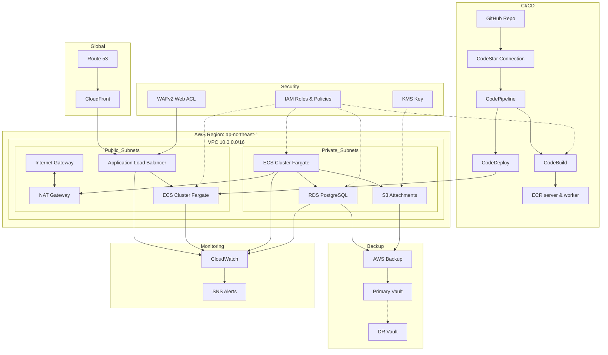
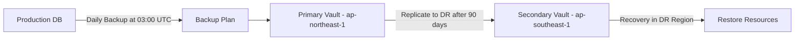

# Cloud Platform Engineer @


## Overview

This repository contains a complete, production-ready AWS infrastructure as code (IaC) for a three-tier CRM application, implemented with Terraform. The goal of this challenge is to demonstrate:

- **Scalable & Secure Architecture** using VPC, NAT gateways, ALB, and WAF
- **Modular IaC**: reusable Terraform modules for networking, security, database, compute, storage, CI/CD, monitoring, backup, and edge delivery
- **Automated CI/CD** via GitHub Actions, building and deploying Dockerized Node.js services to ECS Fargate.Buildspec file for CodeBuild that logs into ECR, builds server & worker images, pushes them, and generates imagedefinitions.json
- **Observability & Alerting** with CloudWatch dashboards and alarms
- **Backup & DR** using AWS Backup with cross-region copy
- **Cost & Security Best Practices** aligned to the AWS Well-Architected framework

---

## Architecture Diagram

Below is a high-level view of the AWS infrastructure:



---

## Prerequisites

- [Terraform 1.5+](https://www.terraform.io/downloads.html) (tested with **Terraform v1.12.2** on darwin_arm64)
- AWS CLI configured with credentials/profile that has IAM, EC2, RDS, S3, ECS, CloudWatch, Backup, CloudFront, Route 53, WAF permissions
- (Optional) [terraform-docs](https://github.com/terraform-docs/terraform-docs) for local module docs

---

## Modules

- networking: VPC, subnets, ALB, NAT/IGW, flow-logs
- security: IAM roles & policies, KMS, WAF, Secrets Manager
- database: RDS PostgreSQL, parameter group, subnet group
- compute: ECS cluster, services, task definitions, autoscaling
- storage: S3 bucket for attachments + lifecycle, encryption, versioning
- ci_cd: CodeBuild, CodePipeline, ECR repos
- monitoring: CloudWatch alarms, SNS topic/subscription
- backup: AWS Backup plans & vaults

---

## Backup

Defines a cross-region backup strategy for RDS and other resources:

- Backup Plan (aws_backup_plan.cross_region): Daily rule at 03:00 UTC, 35 days retention in primary vault, with a copy to the DR vault after 90 days deletion window .
- Backup Selection (aws_backup_selection.rds): Includes RDS instance in the plan.
- Backup Vaults (aws_backup_vault.primary & secondary): “crm-prod-backup-vault” in ap-northeast-1 and DR vault in ap-southeast-1.
- IAM Role & Policy for AWS Backup service.

### RPO/RTO Considerations

RPO (Recovery Point Objective): up to 24 hrs of data loss (daily backups at 03:00 UTC).

RTO (Recovery Time Objective): depends on DB size, typically minutes to an hour for moderate datasets.

#### Diagram



---

## CI/CD

Automates build, approval, and deployment of Dockerized app:

- CodeBuild Project (aws_codebuild_project.build):
  - Uses aws/codebuild/standard:6.0 with privileged mode.
  - Caches both Git source and Docker image layers (LOCAL_SOURCE_CACHE, LOCAL_DOCKER_LAYER_CACHE).
  - Buildspec logs into ECR, builds twenty-server & twenty-worker, pushes images, and writes imagedefinitions.json .
- CodeStar Connection to GitHub (aws_codestarconnections_connection.github).
- CodePipeline (aws_codepipeline.crm): Four stages—Source, Build, ManualApproval, Blue/Green Deploy via CodeDeploy.
- ECR Repositories (aws_ecr_repository.server & worker), IAM roles/policies, and an S3 bucket crm-deployment-artifacts for artifacts.
- CodeDeploy Application & Deployment Group: Blue/green strategy with one-at-a-time deployment and automatic rollback on failure.

---

## Compute

Runs app on ECS Fargate with autoscaling and monitoring:

- ECS Cluster (aws_ecs_cluster.main) named “crm-cluster,” Container Insights enabled.
- Task Definitions for twenty-server (512 CPU, 1 GB RAM) and twenty-worker (256 CPU, 512 MB RAM).
- ECS Services:
  - twenty-server: Desired count 2, behind your ALB, CodeDeploy controller.
  - twenty-worker: Desired count 1, internal tasks-only.
- Autoscaling: TargetTracking on CPU (70%) for twenty-server.
- CloudWatch Log Group for ECS logs with 30-day retention.

---

## Database

Manages PostgreSQL RDS instance:

- RDS Instance (aws_db_instance.main):
  - Engine PostgreSQL 15.5, Multi-AZ enabled, db.t3.medium, 20 GB gp3 storage.
  - Backup window 03:00–06:00, retention 7 days, skip final snapshot on delete.
- Credentials stored in Secrets Manager.
- DB Parameter Group customizing slow‐query logging.
- DB Subnet Group spanning your two private subnets.

---

## Edge

Delivers public UI with low latency and DNS:

- CloudFront Distribution:
  - Origin = your ALB over HTTPS only, TLS 1.2_2021, PriceClass_100.
  - Default TTL 1 hour, compress responses, forward all headers/cookies/queries.
- Route 53 Hosted Zone & Record for crm.example.com pointing at the distribution.

---

## Monitoring

Alerts and logging for critical systems:

- CloudWatch Log Group for VPC Flow Logs (/aws/vpc/flow-logs), 14-day retention.
- Metric Alarms:
  - ALB 5XX > 10 errors/min. Quickly detects backend failures or deployment regressions.
  - ECS CPU > 75% (2 eval periods). Acts as an early warning for compute saturation.
  - ECS Memory > 80%. Alerts on rising memory use to prevent out-of-memory kills, performance degradation, and so on.
  - RDS CPU > 80%. Flags database pressure that can lead to slow queries, lock contention, and timeouts—prompting instance resizing or read-replica planning to maintain query performance.
- Backup failures > 0 per day.
- SNS Topic & Email Subscription for alerts to alerts@example.com

---

## Networking

Foundation for connectivity and security at the VPC level:

- VPC 10.0.0.0/16, DNS support, two public & two private subnets across AZs ap-northeast-1a/b.
- Internet Gateway + public route tables, NAT Gateways for private subnets.
- Route Table Associations for each subnet.
- VPC Flow Logs to CloudWatch with its own IAM role.
- Security Group for ALB (HTTP/HTTPS), and module.security covers ECS & DB SGs.

---

## Security

IAM, encryption, and WAF to protect your data and app:

- IAM Roles & Policies:
- ECS Exec & Task roles, VPC Flow Logs role, Backup role.
- Inline & managed policies attached appropriately.
- KMS Key for encrypting Secrets and S3 objects, with rotation enabled.
- Secrets Manager: Two secrets—App secret & DB superuser password, each with a version object.
- Security Groups for ECS tasks (port 3000) and RDS (port 5432).
- WAFv2 Web ACL “crm-web-acl” using AWS Managed Rules (Common Rule Set).

---

## Storage

Holds user-uploaded attachments:

- S3 Bucket `crm-attachments-123456789012`.
- Lifecycle Configuration:x
- Transition to STANDARD_IA after 30 days, GLACIER after 90 days.
- Abort incomplete multipart uploads.
- Public Access Block (all blocked), Server-side Encryption with KMS, and Versioning enabled.

---

## Getting Started

1.  **Clone the repo**

    ```bash
    git clone git@github.com:Dakarakoso/challenge.git
    cd challenge
    ```

2.  **Review Terraform modules**
    Each module in infrastructure/modules/ has its own `variables.tf`, `outputs.tf`, and `README.md` (you can generate/update via terraform-docs).

3.  **Initialize & Plan (prod)**

    ```bash
    cd infrastructure/environments/prod
    terraform init
    terraform plan -out=tfplan
    ```

4.  **Apply**
    ```bash
    terraform apply "tfplan"
    ```
5.  **Cleanup**
    ```bash
    terraform destroy
    ```

---

## Next steps

- Remote state locking/encryption in S3+DynamoDB
- Container image vulnerability scanning
- Secrets rotation and dynamic secret
- Distributed tracing (AWS X-Ray) for end-to-end request visibility
- caching layers (ElastiCache Redis) for session state
- Tagging strategy & resource naming conventions for cost/accountability
