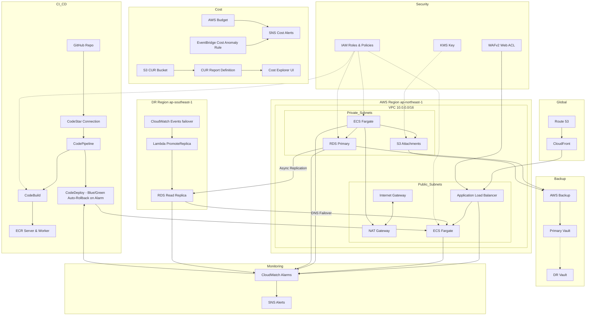
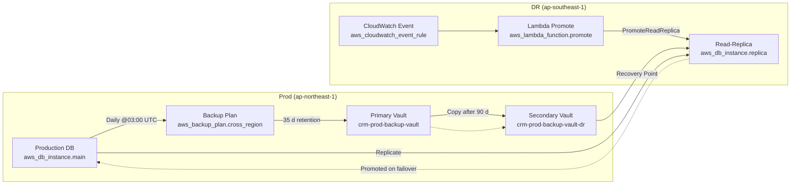

# Cloud Platform Engineer @


## Overview

This repository contains a complete, production-ready AWS infrastructure as code (IaC) for a three-tier CRM application, implemented with Terraform. The goal of this challenge is to demonstrate:

- **Scalable & Secure Architecture** using VPC, NAT gateways, ALB, and WAF
- **Modular IaC**: reusable Terraform modules for networking, security, database, compute, storage, CI/CD, monitoring, backup, and edge delivery
- **Automated CI/CD** via GitHub Actions, building and deploying Dockerized Node.js services to ECS Fargate.Buildspec file for CodeBuild that logs into ECR, builds server & worker images, pushes them, and generates imagedefinitions.json
- **Observability & Alerting** with CloudWatch dashboards and alarms
- **Backup & DR** using AWS Backup with cross-region copy
- **Cost & Security Best Practices** aligned to the AWS Well-Architected framework

---

## Architecture Diagram



---

## Prerequisites

- [Terraform 1.5+](https://www.terraform.io/downloads.html) (tested with **Terraform v1.12.2** on darwin_arm64)
- AWS CLI configured with credentials/profile that has IAM, EC2, RDS, S3, ECS, CloudWatch, Backup, CloudFront, Route 53, WAF permissions
- (Optional) [terraform-docs](https://github.com/terraform-docs/terraform-docs) for local module docs

---

## Modules

- networking: VPC (10.0.0.0/16), public & private subnets, Internet Gateway, NAT Gateways, route tables, VPC Flow Logs
- security: IAM roles & policies (CodeBuild, CodePipeline, Backup, Lambda, ECS, etc.), KMS key, WAFv2 Web ACL, Secrets Manager (DB & app secrets)
- database: RDS PostgreSQL primary (Multi-AZ, backups, parameter group, subnet group), cross-region read replica, module outputs (IDs/ARNs)
- compute: ECS Fargate cluster, task definitions (server & worker), ECS services (public & internal), autoscaling policies, CloudWatch log groups
- storage: S3 bucket for attachments (versioning, server-side encryption with KMS), lifecycle rules (STANDARD_IA & GLACIER transitions, multipart cleanup)
- ci_cd: CodeBuild project (Docker build with source & layer caching), ECR repositories (server & worker), CodePipeline (Source → Build → Manual Approval → Deploy), CodeDeploy Blue/Green with auto-rollback on alarms
- monitoring: CloudWatch metric alarms (ALB 5XX, ECS CPU & memory, RDS CPU, backup failures), SNS topic & email subscription, integration with CodeDeploy rollback
- backup: AWS Backup plan (daily schedule, 35-day primary retention), backup vaults (primary in ap-northeast-1, DR in ap-southeast-1), backup selection for RDS, IAM role for AWS Backup
- failover: CloudWatch Event rule detecting RDS failover, Lambda function to call PromoteReadReplica, IAM role & policy for Lambda, CloudWatch Event → Lambda target and permission configuration

### Terraform dependency graph

## 

## Backup & DR Orchestration

#### Cross-Region Backups

- Backup Plan `aws_backup_plan.cross_region`
  - Runs daily at 03:00 UTC, retaining each recovery point for 35 days in the primary vault, and then automatically copying it to the DR vault after a 90-day window.
- Backup Selection `aws_backup_selection.rds`
  - Includes your primary RDS instance in the plan so that every snapshot is captured.
- Backup Vaults
  - Primary Vault `aws_backup_vault.primary`: crm-prod-backup-vault in ap-northeast-1
- DR Vault `aws_backup_vault.secondary`: crm-prod-backup-vault-dr in ap-southeast-1
- IAM Role & Policy `aws_iam_role.backup_role` + attachment
  - Grants AWS Backup service the permissions it needs to snapshot and copy your data.

#### Near-Real-Time Replication

- **Read-Replica** `aws_db_instance.replica`
  - A cross-region RDS read-replica in ap-southeast-1 that continuously replicates from your primary database, giving you an RPO of near zero for failover scenarios.

#### Automated Failover

- CloudWatch Event Rule `aws_cloudwatch_event_rule.rds_failover`
  - Listens for RDS “failover” events on your primary instance.
- Lambda Promotion Function `aws_lambda_function.promote`
  - Automatically invokes the RDS PromoteReadReplica API on your replica when the event fires, turning it into a standalone primary.
- IAM Role & Policy
  - Allows the Lambda function to call `rds:PromoteReadReplica` on the replica ARN.

### RPO/RTO Considerations

##### RPO (Recovery Point Objective):

- Backups: up to 24 hrs of potential data loss (daily snapshots)
- Replica: near real-time replication means RPO ≈ 0 for read-replica-driven failover

##### RTO (Recovery Time Objective):

- Backups: Minutes to an hour to restore from snapshots, depending on dataset size
- Automated Failover: Seconds to promote the read-replica and redirect traffic (plus DNS or application cut-over time)

#### Diagram



---

## CI/CD

Automates build, approval, and deployment of Dockerized app:

- CodeBuild Project (aws_codebuild_project.build)

  - Uses aws/codebuild/standard:6.0 with privileged_mode = true
  - Caches both Git source and Docker image layers (LOCAL_SOURCE_CACHE, LOCAL_DOCKER_LAYER_CACHE)
  - Buildspec logs into ECR, builds twenty-server & twenty-worker, pushes images, and writes imagedefinitions.json

- CodeStar Connection to GitHub (aws_codestarconnections_connection.github)
- CodePipeline (aws_codepipeline.crm) – Four stages:
  - Source: pulls from GitHub via CodeStarSourceConnection
  - Build: runs the CodeBuild project
  - ManualApproval: pauses for human review
  - Deploy: performs a Blue/Green deployment via CodeDeploy
- ECR Repositories (`aws_ecr_repository.server` & `aws_ecr_repository.worker`), IAM roles/policies, and an S3 bucket crm-deployment-artifacts
  - ECR repos twenty-server and twenty-worker with image-scanning on push
- CodeDeploy Application & Deployment Group

  - Configured for Blue/Green with one-at-a-time traffic shifting
  - `auto_rollback_configuration` enabled on both DEPLOYMENT_FAILURE and DEPLOYMENT_STOP_ON_ALARM
  - Specifies `blue_green_deployment_config` for traffic control and automatic termination of the old (blue) instances on success

  ***

## Compute

Runs app on ECS Fargate with autoscaling and monitoring:

- ECS Cluster (aws_ecs_cluster.main) named “crm-cluster,” Container Insights enabled.
- Task Definitions for twenty-server (512 CPU, 1 GB RAM) and twenty-worker (256 CPU, 512 MB RAM).
- ECS Services:
  - twenty-server: Desired count 2, behind ALB, CodeDeploy controller.
  - twenty-worker: Desired count 1, internal tasks-only.
- Autoscaling: TargetTracking on CPU (70%) for twenty-server.
- CloudWatch Log Group for ECS logs with 30-day retention.

---

## Database

Manages PostgreSQL RDS instance:

- RDS Instance (aws_db_instance.main):
  - Engine PostgreSQL 15.5, Multi-AZ enabled, db.t3.medium, 20 GB gp3 storage.
  - Backup window 03:00–06:00, retention 7 days, skip final snapshot on delete.
- Credentials stored in Secrets Manager.
- DB Parameter Group customizing slow‐query logging.
- DB Subnet Group spanning two private subnets.

---

## Edge

Delivers public UI with low latency and DNS:

- CloudFront Distribution:
  - Origin = ALB over HTTPS only, TLS 1.2_2021, PriceClass_100.
  - Default TTL 1 hour, compress responses, forward all headers/cookies/queries.
- Route 53 Hosted Zone & Record for crm.example.com pointing at the distribution.

---

## Monitoring

Alerts and logging for critical systems:

- CloudWatch Log Group for VPC Flow Logs (/aws/vpc/flow-logs), 14-day retention.
- Metric Alarms:
  - ALB 5XX > 10 errors/min. Quickly detects backend failures or deployment regressions.
  - ECS CPU > 75% (2 eval periods). Acts as an early warning for compute saturation.
  - ECS Memory > 80%. Alerts on rising memory use to prevent out-of-memory kills, performance degradation, and so on.
  - RDS CPU > 80%. Flags database pressure that can lead to slow queries, lock contention, and timeouts—prompting instance resizing or read-replica planning to maintain query performance.
- Backup failures > 0 per day.
- SNS Topic & Email Subscription for alerts to alerts@example.com

---

## Networking

Foundation for connectivity and security at the VPC level:

- VPC 10.0.0.0/16, DNS support, two public & two private subnets across AZs ap-northeast-1a/b.
- Internet Gateway + public route tables, NAT Gateways for private subnets.
- Route Table Associations for each subnet.
- VPC Flow Logs to CloudWatch with its own IAM role.
- Security Group for ALB (HTTP/HTTPS), and module.security covers ECS & DB SGs.

---

## Security

IAM, encryption, and WAF to protect data and app:

- IAM Roles & Policies:
- ECS Exec & Task roles, VPC Flow Logs role, Backup role.
- Inline & managed policies attached appropriately.
- KMS Key for encrypting Secrets and S3 objects, with rotation enabled.
- Secrets Manager: Two secrets—App secret & DB superuser password, each with a version object.
- Security Groups for ECS tasks (port 3000) and RDS (port 5432).
- WAFv2 Web ACL “crm-web-acl” using AWS Managed Rules (Common Rule Set).

---

## Storage

Holds user-uploaded attachments:

- S3 Bucket `crm-attachments-123456789012`.
- Lifecycle Configuration:x
- Transition to STANDARD_IA after 30 days, GLACIER after 90 days.
- Abort incomplete multipart uploads.
- Public Access Block (all blocked), Server-side Encryption with KMS, and Versioning enabled.

---

## Cost Management

- CUR Bucket stores your daily cost reports.
- CUR Report Definition tells AWS to drop CSVs/GZIP into that bucket.
- AWS Budget monitors monthly spend in JPY and alerts via SNS.
- EventBridge Cost Anomaly Rule catches spikes from Cost Explorer and forwards to the same SNS topic.
- Cost Explorer UI lets you do detailed analysis of the CUR files.

---

## Getting Started

1.  **Clone the repo**

    ```bash
    git clone git@github.com:Dakarakoso/challenge.git
    cd challenge
    ```

2.  **Review Terraform modules**
    Each module in infrastructure/modules/ has its own `variables.tf`, `outputs.tf`, and `README.md` (you can generate/update via terraform-docs).

3.  **Initialize & Plan (prod)**

    ```bash
    cd infrastructure/environments/prod
    terraform init
    terraform plan -out=tfplan
    ```

4.  **Apply**
    ```bash
    terraform apply "tfplan"
    ```
5.  **Cleanup**
    ```bash
    terraform destroy
    ```

---

## Next steps

- Remote state locking/encryption in S3+DynamoDB
- Container image vulnerability scanning
- Secrets rotation and dynamic secret
- Distributed tracing (AWS X-Ray) for end-to-end request visibility
- caching layers (ElastiCache Redis) for session state
- Tagging strategy & resource naming conventions for cost/accountability
